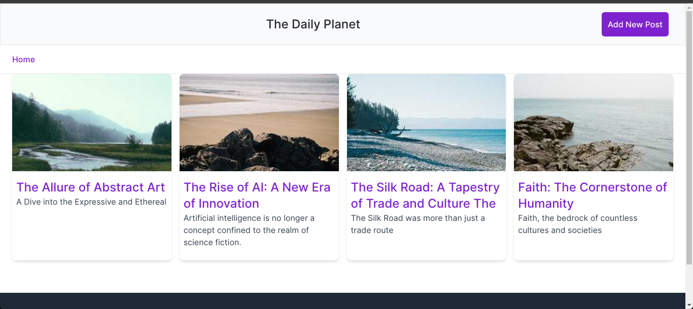

### Sample App

A sample blog application demonstrating the use of FastHTML.

### Setup instruction
1. Clone the repository  
   ``` git clone https://github.com/david-adewoyin/sample_fasthtml.git ```
2. Install the required dependency  
    ```pip install python-fasthtml ```
3. Run the application     
   ``` python main.py ```

### Screenshots


